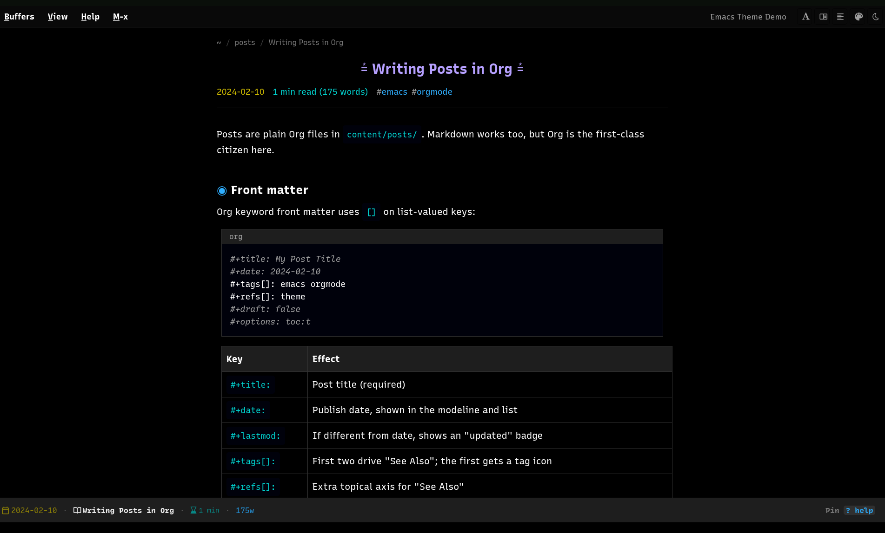
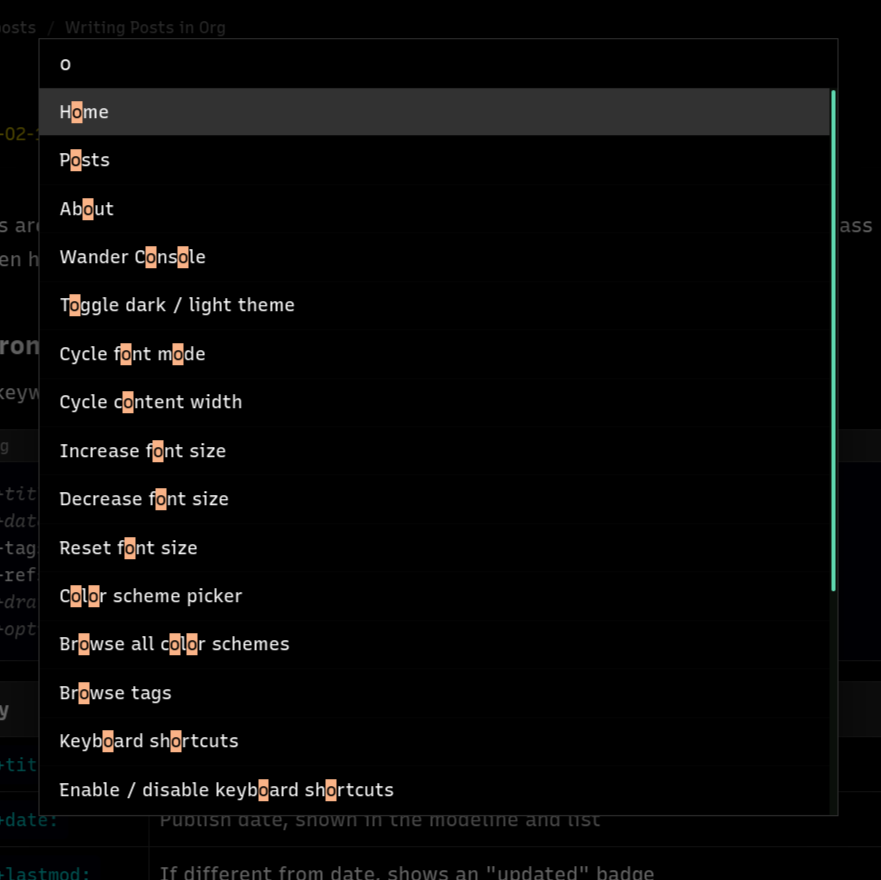
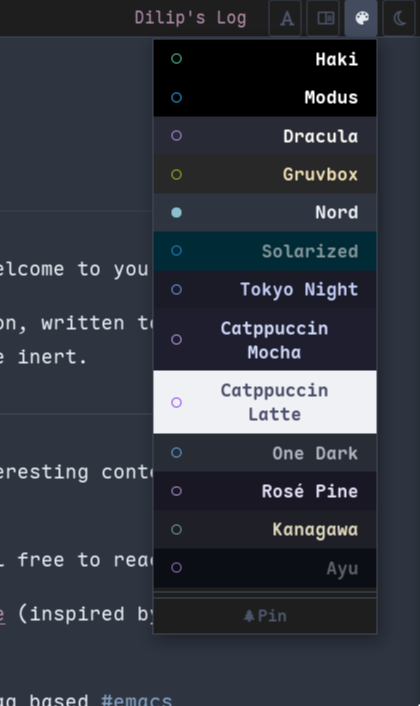

Originally forked from [[https://github.com/ArthurHeymans/hugo-emacs-theme][ArthurHeymans/hugo-emacs-theme]]; commit-by-commit
history of everything since lives in the archived [[https://github.com/idlip/hugo-emacs-theme][idlip/hugo-emacs-theme]].

This project has deviated and has additions personally wanted only
for my site. You are encouraged to either fork or copy into your hugo
site and modify as you require.

* Hakimacs
:PROPERTIES:
:CUSTOM_ID: emacs-hugo-theme
:END:

A Hugo theme that turns a blog into an Emacs-like experience: buffer UI,
modeline, echo area, keyboard navigation, and a full base16 color scheme
system.

Eg: [[https://idlip.in]]

#+begin_quote
This README is the single source of truth. Everything the theme can do,
and how to tweak it, is here. Skip to [[#writing-posts][Writing posts]]
if you just want to blog, or the
[[#full-capability-sample-post][full-capability sample post]] if you
like learning by example.
#+end_quote

--------------

** Table of contents
:PROPERTIES:
:CUSTOM_ID: table-of-contents
:END:
- [[#features-at-a-glance][Features at a glance]]
- [[#install][Install]]
- [[#config-configyaml][Config (=config.yaml=)]]
- [[#writing-posts][Writing posts]]
  - [[#front-matter][Front matter]]
  - [[#content-features][Content features]]
  - [[#callouts-and-sidenotes][Callouts and sidenotes]]
  - [[#code-blocks][Code blocks]]
  - [[#auto-references][Auto references]]
- [[#keyboard-shortcuts][Keyboard shortcuts]]
- [[#color-scheme-system][Color scheme system]]
- [[#special-sections][Special sections]]
- [[#tweaking][Tweaking]]
- [[#file-structure][File structure]]
- [[#full-capability-sample-post][Full-capability sample post]]
- [[#changes-from-upstream-fork][Changes from upstream fork]]
- [[#browser-support][Browser support]]
- [[#credits-and-license][Credits and license]]

--------------

** Features at a glance
:PROPERTIES:
:CUSTOM_ID: features-at-a-glance
:END:
| Feature              | What it does                                                                           |
|----------------------+----------------------------------------------------------------------------------------|
| *Buffer UI*            | Article list (Dired-style) and posts render as Emacs buffers                           |
| *Modeline*             | Buffer name, date, word count, read time, scroll position                              |
| *Command palette*      | =x= opens a native =<dialog>=: search posts, run commands, browse 305 schemes              |
| *Base16 colors*        | 13 presets + all 305 tinted-theming schemes; oklch mixins for faint/warm/cool variants |
| *Random scheme*        | New accent every page load, pin to lock across sessions                                |
| *Font cycling*         | mono → sans → serif → mixed (=f=)                                                        |
| *Width cycling*        | 100% / 80ch / 60ch / 840px (=w=)                                                         |
| *Keyboard nav*         | Vim/Emacs keys for list, post, and palette                                             |
| *Reading progress*     | Top bar fills as you scroll (long posts only)                                          |
| *Table of contents*    | Opt-in per post (=toc: true=)                                                            |
| *Breadcrumbs*          | Auto path trail at top of every post                                                   |
| *Similar posts*        | "See Also" matched on shared =tags= OR =refs=                                              |
| *Prev/next nav*        | =n=/=p= jump between posts in a section                                                  |
| *Auto references*      | External links in a post are collected into a numbered list                            |
| *Callouts / sidenotes* | Note / Tip / Warning boxes + margin sidenotes via shortcodes                           |
| *Comments*             | Zero-backend: a textarea that opens a pre-filled =mailto:=                               |
| *Wander*               | Small-web browser from an org file                                                     |
| *Themes gallery*       | =/themes/= live-preview grid of every base16 scheme, hover to preview, click to pin      |
| *Sitemap*              | =/sitemap/= auto-generated site tree, always reflects the live page tree                 |
| *Grid / list toggle*   | Any =topic-list= page can switch to a card grid, persisted in =localStorage=               |
| *Mobile*               | Single-buffer layout on small screens                                                  |

--------------

** Install
:PROPERTIES:
:CUSTOM_ID: install
:END:

#+begin_src sh
cd your-hugo-site
git submodule add https://github.com/idlip/hakimacs themes/emacs
#+end_src

Minimal =config.yaml=:

#+begin_src yaml
theme: emacs
markup:
  goldmark:
    renderer:
      unsafe: true   # needed for raw HTML / og.svg / shortcodes
  highlight:
    noClasses: false # theme styles chroma classes itself
taxonomies:
  tag: tags
  ref: refs          # optional second axis for "similar posts"
#+end_src

Content lives in =content/= as *Org-mode* files (=.org=), not Markdown.
Markdown still works if you prefer it.

--------------

** Config (=config.yaml=)
:PROPERTIES:
:CUSTOM_ID: config-configyaml
:END:
Site config is YAML (not TOML). The bits the theme reads:

| Key                             | Purpose                                                                                                                                                   |
|---------------------------------+-----------------------------------------------------------------------------------------------------------------------------------------------------------|
| =params.colorSchemes=             | Presets shown in the menu picker. Each: ={ name, label, bg, fg, accent }=. =name= must match a =data-scheme= value in =schemes.css= (empty =name= = Modus default). |
| =params.tagIcons=                 | Flat map of =tag → Nerd Font glyph=, shown before titles in every listing. Has a =_default=.                                                                  |
| =params.socialLinks=              | ={ label, url, icon, rel? }= list. Used by the =social-links= shortcode and the comment mailto (first =mailto:= entry).                                         |
| =params.favicon=                  | Path to favicon.                                                                                                                                          |
| =params.authorName= / =authorEmail= | Author metadata.                                                                                                                                          |
| =taxonomies=                      | =tags= and =refs=. Both feed the "See Also" block.                                                                                                            |
| =menu.main=                       | Top menu items ={ name, weight, url }=.                                                                                                                     |
| =pagination.pagerSize=            | Posts per list page (default 7).                                                                                                                          |
| =staticDir=                       | =[static, static-local]= --- merged, =static-local= wins (used to override the Wander console theme).                                                         |

Example scheme + tag icon entries:

#+begin_src yaml
params:
  colorSchemes:
    - { name: haki,    label: "Haki",    bg: "#000000", fg: "#ffffff", accent: "#5fd7af" }
    - { name: dracula, label: "Dracula", bg: "#282a36", fg: "#f8f8f2", accent: "#bd93f9" }
  tagIcons:
    emacs:    " "
    nixos:    " "
    _default: " "
#+end_src

--------------

** Writing posts
:PROPERTIES:
:CUSTOM_ID: writing-posts
:END:
Drop =.org= files in =content/posts/=.

*** Front matter
:PROPERTIES:
:CUSTOM_ID: front-matter
:END:
Org keyword front matter (note the =[]= on list keys):

#+begin_src org
  ,#+title: My Post Title
  ,#+date: 2026-07-20
  ,#+tags[]: emacs nixos
  ,#+refs[]: dotfiles
  ,#+draft: false
#+end_src

| Key              | Effect                                                                                       |
|------------------+----------------------------------------------------------------------------------------------|
| =#+title:=         | Post title (required).                                                                       |
| =#+date:=          | Publish date, =YYYY-MM-DD=. Shown in modeline + list.                                          |
| =#+lastmod:=       | If set and different from date, shows an "updated" badge.                                    |
| =#+tags[]:=        | Space-separated tags. First two drive "See Also". First one gets a =tagIcon=.                  |
| =#+refs[]:=        | Extra topical axis for "See Also" (posts sharing a ref are related even with no shared tag). |
| =#+draft:=         | =true= hides from build (=hugo serve -D= to preview).                                            |
| =toc: true=        | Show a table of contents (=tocTitle:= renames it).                                             |
| =no_comment: true= | Hide the comment box on this post.                                                           |

*** Content features
:PROPERTIES:
:CUSTOM_ID: content-features
:END:
Automatic on every post, no markup needed:

- *Breadcrumbs* --- path trail at the top.
- *Reading progress bar* --- only when =ReadingTime > 3= or
  =WordCount > 500=.
- *Similar posts* --- up to 5, matched on first two =tags= or =refs=.
- *Prev / next post* navigation at the bottom.
- *References* --- every external link is collected into a numbered list
  above the comment box (see below).

*** Callouts and sidenotes
:PROPERTIES:
:CUSTOM_ID: callouts-and-sidenotes
:END:
Shortcodes (work in both org and markdown):

#+begin_src org

This is a note. *Org / markdown formatting* works inside.


Best-practice hint.

Something might break.

Text with a sidenote.Shows in the right margin on wide
screens, inline on narrow ones. Text continues.
#+end_src

| Shortcode    | Renders                                           |
|--------------+---------------------------------------------------|
| =note=         | Blue "Note" callout                               |
| =tip=          | Green "Tip" callout                               |
| =warn=         | Yellow "Warning" callout                          |
| =sidenote=     | Right-margin aside (collapses inline below 900px) |
| =social-links= | Renders =params.socialLinks= as an icon list        |
| =latest=       | Links the newest post in =/posts/= (title + date)   |

*** Code blocks
:PROPERTIES:
:CUSTOM_ID: code-blocks
:END:
Standard org source blocks render with syntax highlighting and a
language label:

#+begin_src org
  ,#+begin_src python
  def hello():
      print("hi")
  ,#+end_src
#+end_src

Custom language names work too (highlighting is just skipped):

#+begin_src org
,#+begin_src tldr
Short summary block.
,#+end_src
#+end_src

*** Auto references
:PROPERTIES:
:CUSTOM_ID: auto-references
:END:
Every =http(s)= link in the post body is scanned, de-duplicated, and
listed (in order of appearance) in a *References* section right above
the comment box. No manual footer link list. In-page =#anchors= and
footnotes are skipped.

Nothing to configure. Write links normally:

#+begin_src org
See [[https://orgmode.org][Org mode]] and [[https://gohugo.io][Hugo]].
#+end_src

...and they turn up numbered at the bottom.

--------------

** Keyboard shortcuts
:PROPERTIES:
:CUSTOM_ID: keyboard-shortcuts
:END:
*** Global
:PROPERTIES:
:CUSTOM_ID: global
:END:
| Key       | Action                    |
|-----------+---------------------------|
| =x=         | Open command palette      |
| =t= / =i=     | Toggle dark / light theme |
| =f=         | Cycle font mode           |
| =w=         | Cycle content width       |
| =c=         | Open color scheme picker  |
| =?=         | Keyboard help             |
| =C-g= / =Esc= | Cancel / close            |
| =+= / =-=     | Font size up / down       |

*** List page
:PROPERTIES:
:CUSTOM_ID: list-page
:END:
| Key             | Action                  |
|-----------------+-------------------------|
| =n= / =↓=           | Next article            |
| =p= / =↑=           | Previous article        |
| =RET= / =o= / =Space= | Open article            |
| =<= / =>=           | First / last article    |
| =g g= / =g G=       | Top / bottom of list    |
| =g h= / =g p=       | Go home / go to posts   |
| =g w= / =g r=       | Go to Wander / Projects |

*** Post page
:PROPERTIES:
:CUSTOM_ID: post-page
:END:
| Key             | Action               |
|-----------------+----------------------|
| =n= / =p=           | Next / previous post |
| =↓= / =↑=           | Scroll down / up     |
| =Space= / =S-Space= | Page down / up       |
| =C-v= / =M-v=       | Page down / up       |
| =q=               | Back to list         |

*** Command palette
:PROPERTIES:
:CUSTOM_ID: command-palette
:END:
| Key                 | Action                        |
|---------------------+-------------------------------|
| Type to filter      | Search commands and posts     |
| =f = (f-space)      | Post search mode              |
| =t = (t-space)      | Browse all 305 base16 schemes |
| =↑=/=↓= or =C-p=/=C-n=  | Navigate items                |
| =RET=                 | Execute / select              |
| =Backspace= on prefix | Return to command mode        |
| =Esc=                 | Close palette                 |

--------------

** Color scheme system
:PROPERTIES:
:CUSTOM_ID: color-scheme-system
:END:
Three layers, all base16:

1. *Raw palette* --- =--base00..--base0F=, *hex only* (JS sets these
   live, so they cannot be oklch).
2. *Semantic aliases* --- =--fg-main=, =--bg-dim=, =--blue=, etc.,
   mapped from the base slots in =theme.css= (=@layer tokens=).
3. *Transformed variants* --- =-faint= / =-warmer= / =-cooler= via
   =color-mix()= / relative-color oklch.

*Presets* --- 13 built-in schemes from the =󰏘= menu button or =c= key.
Hover previews live, click applies + persists.

*Full library* --- palette (=x=), type =t =, and pick from all 305
[[https://github.com/tinted-theming/schemes][tinted-theming]] schemes
with arrow-key live preview. Applied as inline styles (override the CSS
presets), persisted to =localStorage=, restored before first paint (no
flash).

*Random scheme* --- a new one loads each visit unless you pin it from
the scheme popup.

Add a preset: run =parse-scheme.py=, paste the CSS into =schemes.css=,
add the name to =params.colorSchemes=.

#+begin_src sh
python3 parse-scheme.py data/schemes/dracula.yaml --dark
#+end_src

--------------

** Special sections
:PROPERTIES:
:CUSTOM_ID: special-sections
:END:
| Section      | URL example     | Activated by             | Notes                                                                                                                                      |
|--------------+-----------------+--------------------------+--------------------------------------------------------------------------------------------------------------------------------------------|
| *Posts*        | =/posts/=         | Hugo's default =list.html= | Main blog.                                                                                                                                 |
| *Wander*       | =/wander/=        | =#+layout: topic-list=     | Small-web browser. Both the site list and any neighbour consoles are just =dt/dl= groups under their own H2, same as any other topic-list page. |
| *Projects*     | =/projects/=      | =#+layout: topic-list=     | Org H2 sections become year/group headers with a count badge; items are =dt/dd= pairs supporting =tags:=, =refs:=, or any =key: value= metadata.   |
| *Media*        | =/media/=         | =#+layout: topic-list=     | Same listing, different content --- H2-grouped =dt/dd= entries.                                                                              |
| *Color Themes* | =/themes/=        | =#+layout: themes=         | Live-preview gallery of every base16 scheme (=partial "all-schemes.html"=); hover to preview, click to apply + pin.                          |
| *Sitemap*      | =/sitemap/=       | =#+layout: sitemap=        | Auto-generated site tree --- walks =site.Sections= + top-level pages at build time, so it can't drift out of sync with a hand-written index. |
| *Quotes / Now* | =/quotes/=, =/now/= | org files                | Standard listing pages, no special layout.                                                                                                 |

=topic-list= is one generic layout for any "listing of things" page (Wander,
Projects, Media, and whatever else you invent) --- it's selected by front
matter, not by directory name, so a single top-level =content/foo.org= works
exactly as well as =content/foo/_index.org=. It parses =dt/dd= pairs via the
shared =parse-dl.html= + =extract-href.html= partials, so new metadata fields
are a =strings.HasPrefix= away. =themes= and =sitemap= are the two layouts that
*aren't* front-matter-driven listings --- they read from =site.Data=/=site.Sections=
directly instead of parsing =.Content=.

You can go on write your own Listing page using the =topic-list= template and
carry on.

--------------

** Tweaking
:PROPERTIES:
:CUSTOM_ID: tweaking
:END:
*Fonts and heading glyphs* live in =assets/css/custom.css= at your *site
root* (not the theme), mounted into the CSS pipeline at the =custom.css=
slot. It holds =@font-face= rules and =:root= overrides:

#+begin_src css
  :root {
    --serif-font: "Liberation Serif", "IBM Plex Serif", serif;
  }
  /* heading prefix glyphs: h1 ⩮  h2 ◉  h3 ◈  h4 ✥ */
#+end_src

*CSS pipeline order* (concatenated + fingerprinted in =head.html=):

#+begin_example
theme.css → custom.css → schemes.css → schemes-gen
#+end_example

=theme.css= is one file using native =@layer tokens, base, components, chrome,
overrides= --- the old per-concern split (=main.css=, =menu-bar.css=,
=modeline.css=, etc.) was merged into it; if you see any of those filenames
referenced anywhere, it's stale. =custom.css= (site root, unlayered) and
=schemes.css= (preset named schemes, unlayered) stay separate so they keep
overriding the layered defaults.

*Site-level layout overrides* go in your site's =layouts/= (takes
precedence over the theme) so you never edit the submodule.

*Comments* are backend-free: the box builds a =mailto:= to the first
=mailto:= entry in =socialLinks=, pre-filled with the post title. Swap
the partial if you want Giscus/Disqus.

--------------

** File structure
:PROPERTIES:
:CUSTOM_ID: file-structure
:END:
#+begin_example
themes/emacs/
├── assets/
│   ├── css/
│   │   ├── theme.css        # everything: @layer tokens, base, components, chrome, overrides
│   │   └── custom.css       # site-root override slot (@font-face + font vars)
│   └── js/                  # bundled → app.js (deferred)
│       ├── keyboard.js      # vim/emacs keys, scroll utils, code-copy, lightbox
│       ├── menu.js          # theme toggle, scheme popup, font/width/align cycling
│       ├── palette.js       # command palette (x)
│       └── themes-gallery.js # /themes/ grid: hover preview, click to apply + pin
├── layouts/
│   ├── _default/
│   │   ├── baseof.html      # shell: data-theme/data-scheme, menu, echo area, dialogs
│   │   ├── list.html        # article list buffer
│   │   ├── single.html      # post buffer (progress, toc, references, nav)
│   │   ├── topic-list.html  # generic listing layout (#+layout: topic-list)
│   │   ├── themes.html      # color scheme gallery (#+layout: themes)
│   │   ├── sitemap.html     # auto-generated site tree (#+layout: sitemap)
│   │   ├── terms.html       # taxonomy pages
│   │   ├── list.svg / single.svg  # per-page OG image generator
│   │   └── single.wanderjs.js     # generates wander.js
│   ├── partials/
│   │   ├── head.html        # CSS/JS bundle, schemes JSON, pre-paint restore, JSON-LD
│   │   ├── menu-bar.html    # top menu bar
│   │   ├── modeline.html    # modeline
│   │   ├── post-listing.html
│   │   ├── post-icon.html          # per-row tag icon (params.tagIcons)
│   │   ├── references.html         # "References" + "See Also" (tags + refs)
│   │   ├── comment.html            # mailto comment box
│   │   ├── parse-dl.html           # dt/dd parser (topic-list pages)
│   │   ├── extract-href.html       # href extractor
│   │   ├── topic-list-item.html    # one rendered dt/dd row
│   │   ├── topic-list-js.html      # search filter + grid/list toggle
│   │   ├── all-schemes.html        # merges base16 data + custom-css schemes into one list
│   │   ├── resolve-icon.html       # icon lookup for topic-list rows
│   │   └── lightbox.html           # click-to-zoom image dialog
│   └── shortcodes/
│       ├── note.html  tip.html  warn.html   # callouts
│       ├── sidenote.html
│       ├── social-links.html
│       └── latest.html      # links the newest post
└── README.org
#+end_example

--------------

** Full-capability sample post
:PROPERTIES:
:CUSTOM_ID: full-capability-sample-post
:END:
Copy this to =content/posts/kitchen-sink.org= to see (nearly) every
feature at once:

#+begin_src org
  ,#+title: Kitchen Sink: Everything This Theme Does
  ,#+date: 2026-07-20
  ,#+lastmod: 2026-07-21
  ,#+tags[]: emacs nixos meta
  ,#+refs[]: dotfiles
  ,#+draft: false
  ,#+options: toc:t

  # ↑ toc:t (or `toc: true`) renders a table of contents.
  # refs[] links this post to others sharing the "dotfiles" ref.

  This intro is long enough to trigger the reading-progress bar and the
  "words / min read" stats in the modeline.

  
  This is a *Note* callout. It renders blue. Formatting works inside.
  

  Here is a claim with a margin note.Sidenotes float to
  the right on wide screens and drop inline on mobile.

  ,* Section one

  ,** A code block

  ,#+begin_src python
  def greet(name):
      return f"hello, {name}"
  ,#+end_src

  ,** A custom-language block

  ,#+begin_src tldr
  This block has no syntax highlighting, but still renders with a
  "tldr" language label. Handy for an optional summary.
  ,#+end_src

  ,* Section two: links become references

  I read [[https://orgmode.org][Org mode]] docs and the
  [[https://gohugo.io][Hugo]] docs. Both of these land in the auto-built
  ,*References* list above the comment box, numbered and de-duplicated.

  Use `refs[]` when two posts are related but share no tag.

  `draft: true` keeps a post out of the build until you flip it.
#+end_src

What you get from it: TOC, progress bar, breadcrumbs, tag icons, updated
badge, a note/tip/warning, a sidenote, two code blocks (one custom
=tldr=), a numbered references list, similar posts, and prev/next
navigation.

--------------

** Changes from upstream fork
:PROPERTIES:
:CUSTOM_ID: changes-from-upstream-fork
:END:
Added or replaced after forking from
[[https://github.com/ArthurHeymans/hugo-emacs-theme][hugo-emacs-theme]]:

| Area                     | Change                                                                                            |
|--------------------------+---------------------------------------------------------------------------------------------------|
| *Command palette*          | New =x=-key native =<dialog>=: post search + commands + schemes                                       |
| *Color schemes*            | Full base16 system (13 presets + 305 via tinted-theming) replacing Modus-only                     |
| *Random / custom scheme*   | Per-session random scheme; palette picker persists + restores before paint                        |
| *Font / width cycling*     | mono/sans/serif/mixed via =f=; four widths via =w=                                                    |
| *Post navigation*          | =n=/=p= prev/next; =gg=/=gG=/=gh=/=gp=/=gw=/=gr= sequences                                            |
| *Auto references*          | External links collected into a numbered citations block                                          |
| *Similar posts*            | Matched on =tags= *and* the new =refs= taxonomy                                                         |
| *Callouts / sidenotes*     | note/tip/warn + sidenote shortcodes                                                               |
| *Comments*                 | Backend-free =mailto:= comment box                                                                  |
| *Unified listings*         | One =topic-list= layout powers Wander / Projects / Media via front matter, not directory convention |
| *Themes gallery + sitemap* | =/themes/= live scheme gallery and auto-generated =/sitemap/=, both new generic layouts               |
| *CSS*                      | ~1000 lines of dead code removed; oklch color mixins                                              |
| *JS bundle*                | 4 files → 1 deferred =app.js=                                                                       |

--------------

** Credits and license
:PROPERTIES:
:CUSTOM_ID: credits-and-license
:END:
- Forked from [[https://github.com/ArthurHeymans/hugo-emacs-theme][hugo-emacs-theme]] by Arthur Heymans. See [[https://github.com/idlip/hugo-emacs-theme][previous repo history]]
- Color schemes: [[https://github.com/tinted-theming/schemes][tinted-theming/schemes]] (base16 spec)
- Wander console: [[https://codeberg.org/susam/wander][susam/wander]]
- Inspired by GNU Emacs

Licensed under [[file:LICENSE-MIT][MIT]]. See [[file:LICENSE][LICENSE]] for a One Piece-flavored read of the same terms.

--------------

* Notes
:PROPERTIES:
:CUSTOM_ID: notes
:END:

** Feature ideas / issue tracker

- [ ] Better handle nerd icons natively. Embed a default font so things work without issue.
  Need nerd icon to be double spaced.

- [ ] Make adding bottom stickers easier and make adding web ring easier
